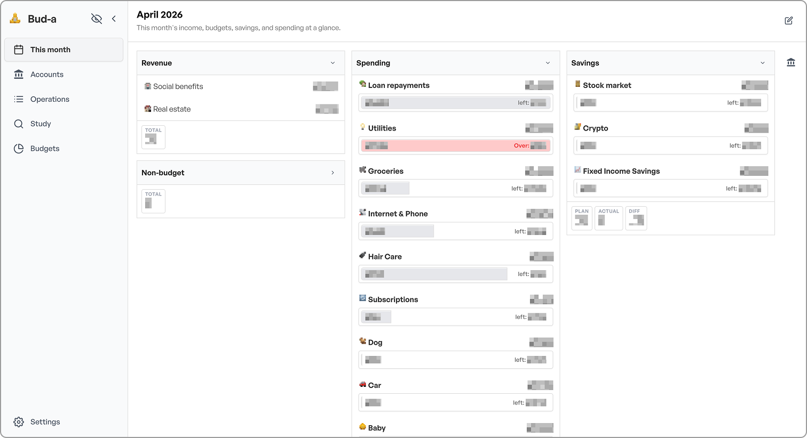
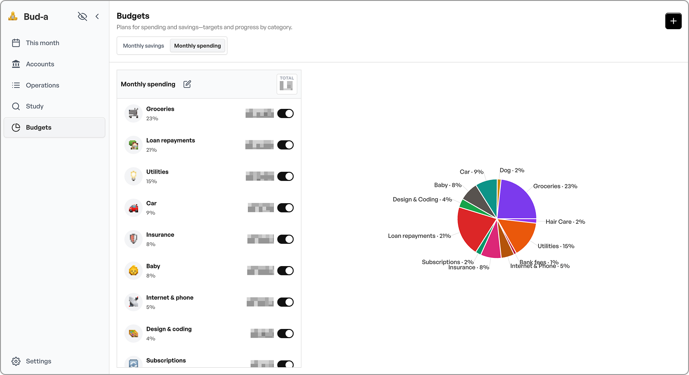
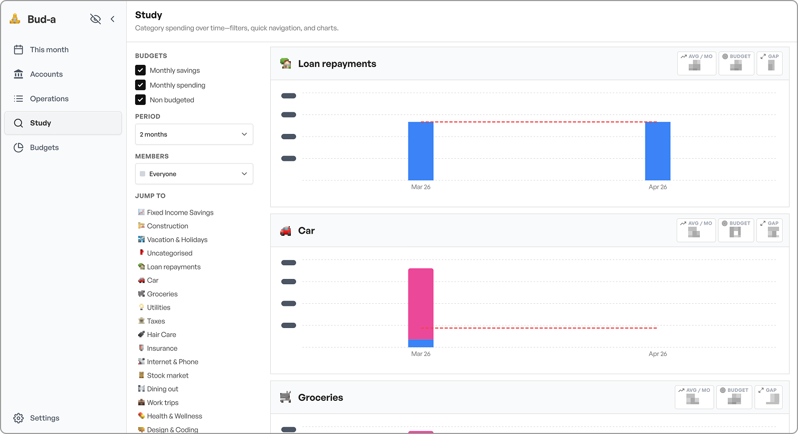
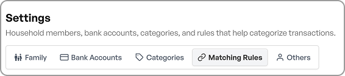

# Bud-a: Opensource AI budget app for families

**What is it:** A household budgeting app that sits on Claude Code and runs on your computer. It combines a web UI, a Python API, and Anthropic AI agents. It tracks spending, parses receipts, and generates financial insights. 

**Who it is for:** Anyone. Just clone the repo, add your own `data/` CSVs, and run the tool locally.

## Web App

### "This Month" tab

This is the homepage. Here, you can create widgets to show categories of expenses. On mine for example, I have all my revenue, my spending budget, and saving budget. 

This takes the data from your operations list, so you can really make it your own. 

If you track a budget you created in the budget page, you'll see a progress bar. On the right side, there is also a side panel to list your bank accounts.



### Budgets tab

This is where you create your budgets. You can have how many you want. I have 2: savings and spendings. You get to name them, then select categories and amounts. Budget history is preserved, because you can change the budget amounts over time, and it wont forget your past budget. Meaning: if your food budget goes up and you update it in May, it will only go up in May.



### Study

In this tab, each category is broken down by month and family member. So you can see how much you spend over time on specific goods and services. The charts are clickable and lead to the oeprations page with the correct filter. 

For example: if you look at how much your husband spent on surfing equipment in july, you just click on the bar chart and it will show you the list of operation. 



### Savings tab

Dedicated view for looking at your savings accounts. It tracks individual or commulated balances over time. IT basically answers the question: am I saving money over time?

### Operations tab

Add, edit, and delete transactions. Each entry includes a date, label, amount, currency, category, family member, and bank account. Supports three types: expense, income, and money movement (transfers between accounts). Filter by month.


### Settings

Central settings page with links to Members, Accounts, and Categories management. Manage spending and income categories with emoji icons and descriptions used for AI auto-categorization. Manage bank accounts. Manage family members with color assignments used in charts and breakdowns.



### Privacy Mode

Toggle privacy mode to redact all amounts in the UI. Great when showing bud-a to people.


## AI Layer

### Agents

- **Receipt Parser** — Send a receipt photo or text and the agent extracts the date, merchant, items, and total. It suggests a category using your matching rules, confirms with you, and saves the expense.
- **Budget Analyst** — Ask for spending breakdowns, trends, category comparisons, or anomaly detection. Generates reports with tables, percentages, and actionable suggestions.
- **Backup Manager** — Creates encrypted backups of all financial data. Can also restore and verify backups.
- **Data Integrity Checker** — Audits CSV files for orphaned foreign keys, duplicate IDs, missing fields, and invalid formats.

### Slash Commands

- `/add-expense` — Guided expense entry with validation
- `/monthly-report` — Detailed monthly spending analysis with category breakdowns, budget comparisons, and trends
- `/expense-matching` — Auto-categorize expenses using matching rules and category descriptions
- `/backup` — One-command encrypted backup of all data

### Expense Auto-Categorization

When logging an expense, the AI reads your personal matching rules from `data/matching_rules.json` to automatically suggest a category based on the transaction label. If no rule matches, it falls back to the category descriptions in `data/categories.csv`. See [Customize expense matching](#customize-expense-matching) below.

## Telegram Integration

Interact with Bud-A remotely via Telegram — log expenses, parse receipts, and request reports from your phone.

### Setup

1. Create a bot with [@BotFather](https://t.me/BotFather) and copy the bot token.
2. Create the file `.claude/channels/telegram/.env` (create the folders if needed):
  ```
   TELEGRAM_BOT_TOKEN=your_token_here
  ```
3. Start Claude with:
  ```bash
   claude --channels plugin:telegram@claude-plugins-official
  ```

The `.claude/channels/` path is listed in `.gitignore`, so your token file is never committed.

## Getting Started

### Prerequisites

- Python 3.10+
- Node.js 18+
- A [Claude Code](https://claude.ai/code) subscription

### Quick Start

```bash
./start.sh
```

Installs dependencies when needed and starts both servers. On first run, it prompts for your default currency (e.g. EUR, USD, GBP) and creates the `.env` files automatically. The UI is at **[http://localhost:5173](http://localhost:5173)**.

### Manual Start

```bash
# Terminal 1 — Backend (port 8000)
cd backend && pip install -r requirements.txt && python main.py

# Terminal 2 — Frontend (port 5173)
cd frontend && npm install && npm run dev
```

### Stopping

Press `Ctrl+C` in the terminal running `start.sh` to stop both servers.

### Environment Variables

Copy the example files and edit as needed (or let `start.sh` create them on first run):

```bash
cp backend/.env.example backend/.env
cp frontend/.env.example frontend/.env
```


| Variable                | File            | Default                 | Description                                     |
| ----------------------- | --------------- | ----------------------- | ----------------------------------------------- |
| `CORS_ORIGINS`          | `backend/.env`  | `http://localhost:5173` | Allowed frontend origins (comma-separated)      |
| `DEFAULT_CURRENCY`      | `backend/.env`  | `EUR`                   | Default currency code (ISO 4217)                |
| `VITE_API_URL`          | `frontend/.env` | `http://localhost:8000` | Backend API URL                                 |
| `VITE_DEFAULT_CURRENCY` | `frontend/.env` | `EUR`                   | Default currency for new operations and display |
| `VITE_CURRENCIES`       | `frontend/.env` | `EUR,USD,GBP,CHF,CAD`   | Currency codes shown in dropdowns               |


## Customize Expense Matching

After setting up your categories in `data/categories.csv`, add your own merchant patterns to `data/matching_rules.json`:

```json
[
  {
    "id": "a-uuid-here",
    "pattern": "when you see something like: \"NETFLIX\", it means subscriptions",
    "category_id": "the-uuid-of-your-subscriptions-category"
  }
]
```

Find your category IDs by opening `data/categories.csv` or running `/monthly-report`. The file lives in `data/` so it is gitignored and stays private to your machine.

## Security

- All data stays on your machine — no cloud database
- Data exports are protected by a backup password (PBKDF2-SHA256 hashed)
- Financial amounts are never logged or printed
- All inputs are validated before saving
- Private keys never leave the local machine
- `data/` and `.claude/channels/` are gitignored and never committed

## Repository Layout

- `frontend/` — React 19 + Vite 8 app with styled-components and Recharts (tracked by git)
- `backend/` — Python FastAPI app (tracked by git)
- `.claude/` — AI agents, skills, and rules (tracked by git)
- `data/` — CSV files, preferences, matching rules, and bank logos (gitignored)
- `backups/` — Encrypted backup files (gitignored)
- `start.sh` — One-command launcher for both servers with first-time setup

## Data Model

All tables are CSV files stored locally in `data/`. Amounts are stored as integers (cents). Dates use ISO 8601 (YYYY-MM-DD). Every record has a UUID primary key. Tables are linked by foreign keys.

### `data/members.csv`


| Column     | Type   | Description              |
| ---------- | ------ | ------------------------ |
| id         | UUID   | Primary key              |
| first_name | string | First name               |
| last_name  | string | Last name                |
| email      | string | Email address            |
| phone      | string | Phone number             |
| color      | string | Hex color used in charts |


### `data/accounts.csv`


| Column               | Type    | Description                                            |
| -------------------- | ------- | ------------------------------------------------------ |
| id                   | UUID    | Primary key                                            |
| member_id            | UUID    | FK → members.id                                        |
| bank_name            | string  | Name of the bank                                       |
| account_number       | string  | Account number                                         |
| nickname             | string  | Friendly name (e.g. "Joint Checking")                  |
| type                 | string  | `checking`, `savings`, `credit`, `investment`          |
| currency             | string  | ISO 4217 code (e.g. EUR, USD)                          |
| opening_balance      | integer | Opening balance in cents                               |
| opening_balance_date | string  | Date of the opening balance (YYYY-MM-DD)               |
| statement_balance    | integer | Latest statement balance in cents                      |
| statement_date       | string  | Date of the latest statement (YYYY-MM-DD)              |
| logo                 | string  | Filename of the bank logo in `data/images/bank-logos/` |
| image_url            | string  | URL of the bank logo (alternative to local file)       |
| is_savings           | string  | Whether this is a savings account (`true`/`false`)     |


### `data/categories.csv`


| Column      | Type   | Description                                       |
| ----------- | ------ | ------------------------------------------------- |
| id          | UUID   | Primary key                                       |
| name        | string | Category name (e.g. `Food`, `Dining out`)         |
| emoji       | string | Single emoji for the category icon                |
| description | string | Short description used for AI auto-categorization |


### `data/operations.csv`


| Column          | Type    | Description                                         |
| --------------- | ------- | --------------------------------------------------- |
| id              | UUID    | Primary key                                         |
| type            | string  | `expense`, `income`, or `money_movement`            |
| date            | string  | Transaction date (YYYY-MM-DD)                       |
| member_id       | UUID    | FK → members.id                                     |
| from_account_id | UUID    | FK → accounts.id (source account)                   |
| to_account_id   | UUID    | FK → accounts.id (destination, for money movements) |
| label           | string  | Description of the operation                        |
| category_id     | UUID    | FK → categories.id                                  |
| amount          | integer | Amount in cents                                     |
| currency        | string  | ISO 4217 code (e.g. USD, EUR)                       |


### `data/budget_plans.csv`


| Column | Type   | Description                                  |
| ------ | ------ | -------------------------------------------- |
| id     | UUID   | Primary key                                  |
| name   | string | Plan name (e.g. "Household", "Savings plan") |
| kind   | string | Plan type (e.g. `budget`, `savings`)         |


### `data/budgets.csv`


| Column         | Type    | Description                                      |
| -------------- | ------- | ------------------------------------------------ |
| id             | UUID    | Primary key                                      |
| budget_plan_id | UUID    | FK → budget_plans.id                             |
| category_id    | UUID    | FK → categories.id                               |
| amount         | integer | Budget amount in cents                           |
| period         | string  | `monthly`, `weekly`, or `yearly`                 |
| currency       | string  | ISO 4217 code                                    |
| start_date     | string  | Date this budget took effect (YYYY-MM-DD)        |
| end_date       | string  | Date this budget was replaced (empty if current) |


### `data/matching_rules.json`

Personal merchant → category rules for auto-categorization. Managed through the app or edited directly.


| Field       | Type   | Description                                          |
| ----------- | ------ | ---------------------------------------------------- |
| id          | UUID   | Primary key                                          |
| pattern     | string | Natural language description of the merchant pattern |
| category_id | UUID   | FK → categories.id                                   |


### `data/preferences.json`

App-level settings stored as JSON (not CSV). Managed via the `/api/preferences/` endpoints.


| Field                | Type   | Description                               |
| -------------------- | ------ | ----------------------------------------- |
| default_currency     | string | Default ISO 4217 currency code            |
| backup_password_hash | string | PBKDF2-SHA256 hash of the backup password |
| backup_password_salt | string | Salt used for hashing                     |


### Data Export

The backend provides a `/api/preferences/export` endpoint that packages all CSV files, matching rules, and preferences into a ZIP archive. Requires the backup password to download.

### Relationships

```
members      ──< accounts       (one member has many accounts)
members      ──< operations     (one member has many transactions)
categories   ──< operations     (one category has many transactions)
categories   ──< budgets        (one category has many budget periods)
categories   ──< matching_rules (one category has many matching rules)
accounts     ──< operations     (via from_account_id / to_account_id)
budget_plans ──< budgets        (one plan has many category budgets)
```

